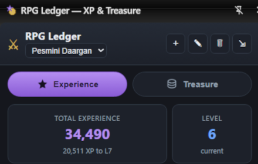
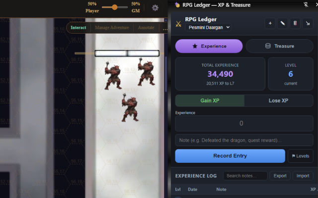
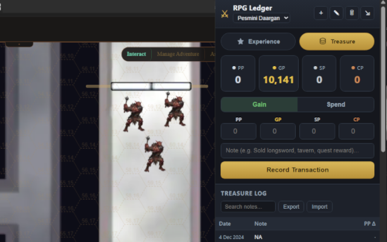

# Overview
Per-character tracking of experience (with levels) and treasure (PP/GP/SP/CP). Persistent storage, side panel, JSON import/export.

Keep a tidy ledger for your tabletop RPG characters — experience and treasure, side by side.

RPG Ledger tracks two things per character:

**EXPERIENCE** • Log XP gains and losses with a note and date (day-month-year). • Set per-character level thresholds (cumulative XP to reach each level), or load a standard 5e table in one click. • See current level and total XP at a glance, plus how far you are from the next level. Each log entry shows the character's level as of that entry.

**TREASURE** • Track Platinum, Gold, Silver, and Copper as independent columns (no forced conversion). • Record gains and spends with a note; running balances update automatically.

**FOR EVERY CHARACTER** • Switch characters from a single dropdown; add, rename, or remove characters freely. • Toggle between the Experience and Treasure views without changing your selected character. • Search your logs by note text.

**YOUR DATA STAYS YOURS** • Everything is stored locally in your browser. Nothing is sent anywhere — no accounts, no servers, no tracking. • Export a JSON backup any time, and import it on another computer to move or restore your data. • Works in both the toolbar popup and the side panel, so it can sit open beside your game.

Built for D&D-style play but useful for any system that tracks points and currency.

-----

### Chrome Web Store 
  
  
### Chrome Web Store experience screenshot   
  
  
### Chrome Web Store treasure screenshot   
  

----